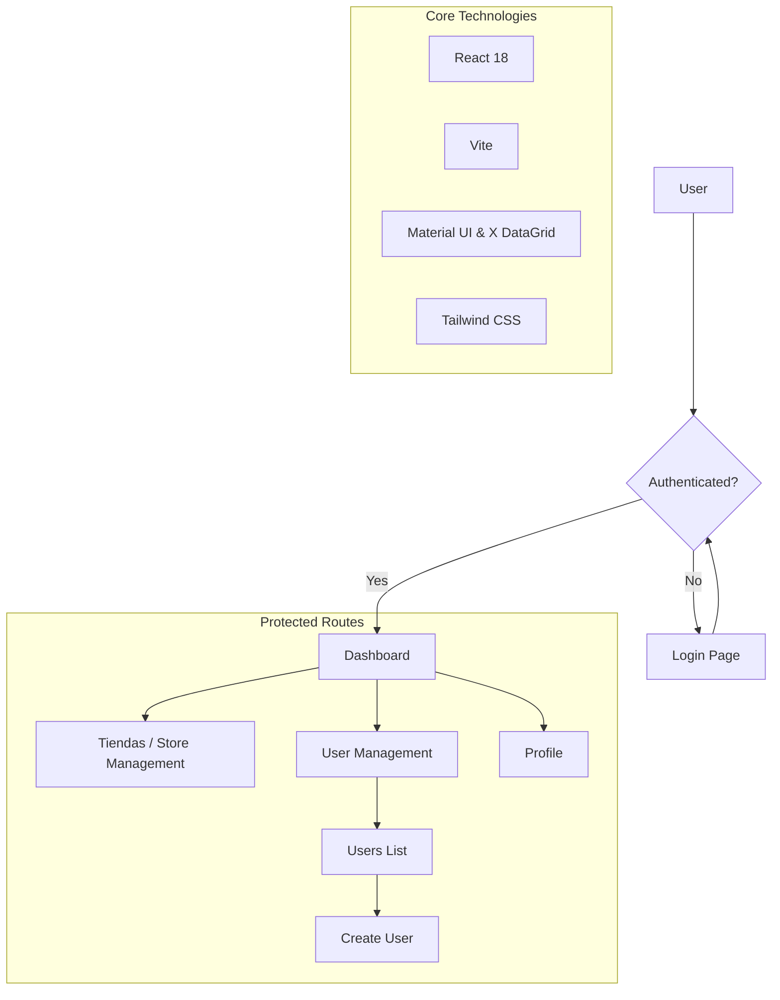

# T1 Admin Console / Velocity Admin


A modern, high-performance administration dashboard for managing stores and users. Built with **React 18**, **TypeScript**, and **Vite**, featuring a clean and professional design powered by **Tailwind CSS** and **Material UI (MUI)**.

## 🏗 Architecture & Flow



## 🚀 Key Features

- **Unified Store Search**: Powerful search engine that accepts either **Store ID (IDT1)** or **Store Name**, returning enriched data including associated users.
- **Advanced Assignment System**: Refined **MUI X DataGrid** integration for managing store-user assignments with tag-based visualization and scrollable overflow.
- **User Administration**: Comprehensive Role-Based Access Control (RBAC) with dedicated workflows for Super Users and Administrators.
- **Identity v3 Integration**: Seamless integration with external Identity V3 APIs for real-time user and store information retrieval.
- **Premium UI/UX**: Professional aesthetics with dark mode support, smooth transitions via **Framer Motion**, and a responsive layout for all devices.
- **Interactive Analytics**: Real-time data visualization using **ApexCharts** for business insights.

## 🛠 Tech Stack

- **Framework**: [React 18](https://reactjs.org/)
- **Build Tool**: [Vite](https://vitejs.dev/)
- **Language**: [TypeScript](https://www.typescriptlang.org/)
- **Styling**: [Tailwind CSS](https://tailwindcss.com/) & [Material UI v7](https://mui.com/)
- **Data Grid**: [MUI X DataGrid](https://mui.com/x/react-data-grid/)
- **Icons**: [Lucide React](https://lucide.dev/) & [FontAwesome](https://fontawesome.com/)
- **Charts**: [ApexCharts](https://apexcharts.com/)
- **Animation**: [Framer Motion](https://www.framer.com/motion/)
- **API Client**: [Axios](https://axios-http.com/)

## 📦 Getting Started

### Prerequisites

- Node.js (v18 or higher)
- npm or yarn

### Installation

1. Clone the repository:
   ```bash
   git clone <repository-url>
   cd t1-admin-consola-v1
   ```

2. Install dependencies:
   ```bash
   npm install
   ```

### Development

Start the development server:
```bash
npm run dev
```

### Build

Build the project for production:
```bash
npm run build
```

The production-ready files will be available in the `dist/` directory.

## 📁 Project Structure

```text
src/
├── components/       # UI Components (Dashboard, Login, Tiendas, etc.)
│   └── tiendas/      # Store-specific components and modals
├── models/           # TypeScript Interfaces and Mongoose-compatible Types
├── services/         # API Service Layer (Axios & Identity v3)
├── utils/            # Auth helpers, formatting, and general utilities
├── assets/           # Static Assets (Images, Icons)
├── App.tsx           # Main Routing and Theme Configuration
└── main.tsx          # Application Entry Point
```

## 📄 License

This project is licensed under the MIT License - see the [LICENSE](LICENSE) file for details.
